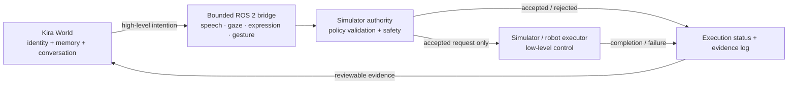

# Kira World × Hanson Robotics: bounded ROS 2 intention bridge

This repository contains the **first simulator-first proof of concept** requested by David Chen at Hanson Robotics:

> Kira World emits a small set of high-level intentions—speech, gaze, facial expression, and gesture—over a clearly defined ROS 2 interface, while the simulator or robot remains authoritative for safety and low-level execution.

The bridge is deliberately narrow. It does **not** command motors, joints, navigation, or unrestricted robot behavior. It demonstrates the separation between:

- **Kira World:** identity, reviewed memory, conversation, and high-level intention selection.
- **Bridge contract:** bounded, inspectable intention messages.
- **Simulator/robot authority:** validation, safety limits, execution, rejection, and status evidence.

## Current status

- Four dedicated intention message types: speech, gaze, expression, and gesture.
- One execution-status message returned by the simulator authority.
- YAML safety policy with allowlists and bounded values.
- A simulator-authority ROS 2 node that accepts or rejects intentions.
- JSONL evidence logging for every decision.
- A demo publisher with four accepted intentions and one intentionally rejected gesture.
- A console status monitor.
- A pure-Python standalone demo and unit tests for the policy layer.
- A mapping template for adapting this bridge to Hanson Robotics' official ROS 2 messages later.

### Honest boundary

This proof of concept has **not** been tested against a Hanson Robotics production robot, the current Hanson simulator, or finalized official Hanson message definitions. The interface is intentionally replaceable so it can be mapped to official messages when Hanson Robotics is ready to share them.

## Architecture



## ROS 2 topics

| Topic | Message | Direction |
|---|---|---|
| `/kira/intents/speech` | `kira_intent_interfaces/SpeechIntent` | Kira → authority |
| `/kira/intents/gaze` | `kira_intent_interfaces/GazeIntent` | Kira → authority |
| `/kira/intents/expression` | `kira_intent_interfaces/ExpressionIntent` | Kira → authority |
| `/kira/intents/gesture` | `kira_intent_interfaces/GestureIntent` | Kira → authority |
| `/kira/execution_status` | `kira_intent_interfaces/ExecutionStatus` | authority → Kira |

The proof of concept publishes an immediate policy decision. A production adapter can add separate `started`, `completed`, `failed`, and `cancelled` lifecycle events after mapping to the official simulator or robot interface.

## Standalone policy demo

The standalone demo lets the bounded-policy layer be reviewed without installing ROS 2.

```bash
cd integrations/hanson_ros2_bridge
python -m pip install -r standalone/requirements.txt
python standalone/demo.py
python -m unittest discover -s standalone/tests -v
```

The expected sequence accepts speech, gaze, an attentive expression, and a wave. It rejects an unapproved `unbounded_spin` gesture and writes `standalone/evidence.jsonl`.

## ROS 2 build

```bash
cd integrations/hanson_ros2_bridge/ros2_ws
source /opt/ros/$ROS_DISTRO/setup.bash
rosdep install --from-paths src --ignore-src -r -y
colcon build --symlink-install
source install/setup.bash
ros2 launch kira_hanson_bridge demo.launch.py
```

Expected behavior:

1. `demo_intent_source` publishes five bounded intentions.
2. `simulator_authority` checks each request against `safety_policy.yaml`.
3. Four requests are accepted.
4. The unapproved gesture is rejected with `GESTURE_NOT_ALLOWED`.
5. `status_monitor` prints each decision.
6. The authority writes a JSONL record for each decision.

The default ROS evidence log is `/tmp/kira_hanson_bridge_evidence.jsonl`.

## Safety principles demonstrated

1. **No direct motor control from Kira World.**
2. **Allowlisted expression and gesture vocabulary.**
3. **Bounded intensity, speed, duration, text size, gaze range, and time-to-live.**
4. **Stale or malformed intentions fail closed.**
5. **Every acceptance or rejection returns a machine-readable reason.**
6. **Every policy decision is logged as evidence.**
7. **The robot/simulator remains the final authority.**

## Mapping to Hanson Robotics

See `docs/INTERFACE_CONTRACT.md`, `docs/HANSON_MAPPING_TEMPLATE.md`, and `docs/SAFETY_MODEL.md`.

The mapping layer should translate the bounded Kira messages into official Hanson messages without weakening robot-side safety. No official topic names, frame names, expression vocabulary, or gesture vocabulary are assumed here.

## Suggested first live demonstration

1. Kira says a short sentence.
2. Kira looks toward a named target.
3. Kira requests an attentive expression.
4. Kira requests a wave.
5. Kira requests an unsupported motion.
6. The authority accepts the first four, rejects the fifth, and logs every result.

## Questions for Hanson Robotics

- Which ROS 2 distribution should the integration target?
- What official topic or action interfaces will handle speech, gaze, expression, and gesture?
- Which coordinate frames and units should gaze use?
- What expression and gesture vocabulary is officially supported?
- Does the simulator expose acknowledgement and completion events separately?
- What rate limits, duration limits, cancellation semantics, and safety states should the bridge respect?
- Is a ROS 2 action interface preferred over topics for any intention category?

## License

MIT. The message contract is a prototype and may change when official Hanson interfaces are available.
